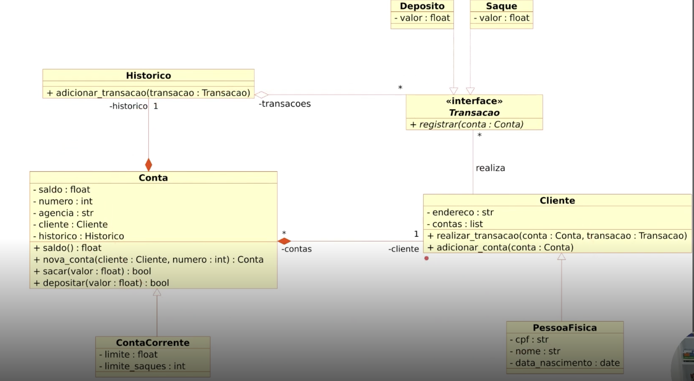

# Sistema Bancário — Desafio DIO

> **Desafio:** Modelagem de Sistema Bancário com POO em Python
> **Bootcamp:** Python AI Backend Developer: [DIO](https://www.dio.me/)
> **Autor:** Igor

---

## Sobre o Projeto

Este projeto implementa um **sistema bancário orientado a objetos** desenvolvido como parte do desafio proposto pela [Digital Innovation One (DIO)](https://www.dio.me/). O objetivo é modelar as principais entidades de um banco — clientes, contas, transações e histórico — aplicando os pilares da POO: **herança**, **encapsulamento**, **polimorfismo** e **abstração**.

O sistema foi construído inteiramente em Python, seguindo o diagrama de classes fornecido no desafio, com organização em módulos e boas práticas de desenvolvimento.

---

## Funcionalidades

- Cadastro de clientes (Pessoa Física) com validação de CPF duplicado
- Criação de Conta Corrente vinculada a um cliente
- Realização de **depósitos** e **saques** com validação de valor
- Validação de saldo insuficiente nos saques
- Consulta de **extrato** com histórico de transações
- **Listagem de clientes** e suas contas vinculadas
- **Listagem de contas** com saldo atual
- Suporte a múltiplas contas por cliente com seleção interativa
- Registro automático de todas as transações no **histórico**

---

## Diagrama de Classes (UML)



O diagrama acima representa a arquitetura completa do sistema. Abaixo, uma descrição detalhada de cada entidade.

---

## Arquitetura e Módulos

```
SistemaBancario/
├── core/
│   ├── transacao.py        # Classe abstrata base para transações
│   ├── deposito.py         # Implementação de depósito
│   ├── saque.py            # Implementação de saque
│   ├── historico.py        # Registro do histórico de transações
│   ├── conta.py            # Conta base genérica
│   ├── contacorrente.py    # Conta corrente com limite e controle de saques
│   ├── cliente.py          # Cliente base genérico
│   └── pessoa_fisica.py    # Pessoa física (extensão de cliente)
└── main.py                 # Ponto de entrada e demonstração do sistema
```

---

## Descrição das Classes

### `Transacao` — `core/transacao.py`
Classe abstrata (ABC) que define o contrato para qualquer tipo de transação.

| Método | Descrição |
|---|---|
| `registrar(conta)` | Registra a transação no histórico da conta |

> Toda transação concreta deve herdar de `Transacao`.

---

### `Depositar` — `core/deposito.py`
Representa uma operação de depósito. Herda de `Transacao`.

| Atributo/Método | Descrição |
|---|---|
| `valor: float` | Valor a ser depositado |
| `registrar(conta)` | Executa o depósito na conta e registra no histórico |

---

### `Saque` — `core/saque.py`
Representa uma operação de saque. Herda de `Transacao`.

| Atributo/Método | Descrição |
|---|---|
| `valor: float` | Valor a ser sacado |
| `registrar(conta)` | Executa o saque na conta (se saldo suficiente) e registra no histórico |

---

### `Historico` — `core/historico.py`
Armazena todas as transações realizadas em uma conta.

| Atributo/Método | Descrição |
|---|---|
| `transacao: list` | Lista de todas as transações registradas |
| `adicionar_transacao(transacao)` | Adiciona uma transação à lista |

---

### `Conta` — `core/conta.py`
Classe base que representa uma conta bancária genérica.

| Atributo | Descrição |
|---|---|
| `saldo: float` | Saldo atual da conta (inicia em `0`) |
| `numero: int` | Número único gerado aleatoriamente (5 dígitos) |
| `agencia: str` | Agência fixa `"0001"` |
| `cliente: Cliente` | Cliente titular da conta |
| `historico: Historico` | Histórico de transações da conta |

| Método | Descrição |
|---|---|
| `nova_conta(cliente, historico)` | Método de fábrica (`classmethod`) para criar uma conta |
| `sacar(valor) → bool` | Realiza saque se saldo suficiente; retorna `True` em caso de sucesso |
| `depositar(valor) → bool` | Realiza depósito se valor positivo; retorna `True` em caso de sucesso |

---

### `ContaCorrente` — `core/contacorrente.py`
Especialização de `Conta` com limite de crédito e controle de saques. Herda de `Conta`.

| Atributo | Descrição |
|---|---|
| `limite: float` | Limite de crédito (padrão: `R$ 500,00`) |
| `saques: int` | Número máximo de saques permitidos (padrão: `3`) |

| Método | Descrição |
|---|---|
| `nova_conta(cliente, historico, limite, saques)` | Método de fábrica para criar uma conta corrente |

---

### `Cliente` — `core/cliente.py`
Classe base que representa um cliente do banco.

| Atributo | Descrição |
|---|---|
| `endereco: str` | Endereço residencial do cliente |
| `contas: list` | Lista de contas vinculadas ao cliente |

| Método | Descrição |
|---|---|
| `realizar_transacao(conta, transacao)` | Delega a execução de uma transação na conta informada |
| `adicionar_conta(conta)` | Vincula uma conta ao cliente |

---

### `PessoaFisica` — `core/pessoa_fisica.py`
Especialização de `Cliente` com dados pessoais. Herda de `Cliente`.

| Atributo | Descrição |
|---|---|
| `cpf: str` | CPF do titular |
| `nome: str` | Nome completo |
| `data_nascimento: str` | Data de nascimento no formato `YYYY-MM-DD` |

---

## Como Executar

### Pré-requisitos
- Python 3.8+

### Instalação e execução
```bash
# Clone o repositório
git clone <url-do-repositorio>
cd SistemaBancario

# Execute o sistema
python main.py
```

### Menu interativo
```
========================================
         SISTEMA BANCÁRIO
========================================
[1] Novo cliente
[2] Nova conta corrente
[3] Depositar
[4] Sacar
[5] Extrato
[6] Listar clientes
[7] Listar contas
[0] Sair
----------------------------------------
=>
```

---

## Exemplo de Sessão

```
=> 1
CPF: 123.456.789-00
Nome: Imperador
Data de nascimento (AAAA-MM-DD): 2001-08-21
Endereço: Brasilia
Cliente 'Imperador' cadastrado com sucesso.

=> 2
CPF do titular: 123.456.789-00
Conta 45231 criada para Imperador | Agência: 0001

=> 3
CPF do titular: 123.456.789-00
Valor do depósito: R$ 1000
Depósito de R$ 1000.00 realizado. Saldo: R$ 1000.00

=> 5
CPF do titular: 123.456.789-00

--- Extrato | Conta 45231 ---
  1. Depositar   R$ 1000.00
  Saldo atual: R$ 1000.00
-------------------------------
```

---

## Conceitos de POO Aplicados

| Conceito | Onde é aplicado |
|---|---|
| **Herança** | `PessoaFisica → Cliente`, `ContaCorrente → Conta`, `Depositar/Saque → Transacao` |
| **Encapsulamento** | Todos os atributos são privados (`_atributo`) e expostos via `@property` |
| **Abstração** | `Transacao` é uma classe abstrata (ABC) — não pode ser instanciada diretamente |
| **Polimorfismo** | `registrar()` se comporta diferente em `Depositar` e `Saque` |
| **Composição** | `Conta` possui um `Historico`; `Cliente` possui uma lista de `Conta` |
| **Method Factory** | `nova_conta()` como `@classmethod` em `Conta` e `ContaCorrente` |

---

## Tecnologias

- **Python 3.8+**
- `abc` — classes e métodos abstratos
- `random` — geração de número de conta
- `__future__.annotations` — suporte a type hints circulares

---

## Licença

Projeto desenvolvido para fins educacionais como parte do bootcamp da **DIO**.
Sinta-se livre para usar, estudar e modificar. ✌️
